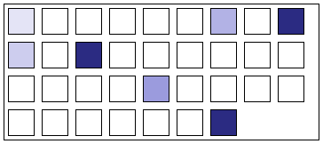

# NG2 Bind View Component

  

This package provides a very simple NG2 Component that presents a grid/heatmap like view of a binning of some dataset statistic. Think [github activity grid](https://github.com/sam-at-github) but simpler and not necessarily time orientated. Summary:

  + The data you pass in has to be shaped or reshaped to be an array of `Bin`:

        export interface Bin {
          index: number;
          stat: number;
        }

  + The component has one Input/Output; `selected()`. A grid box is `selected` on click.
  + The package is actually includes a valid angular application which `npm start` starts.
  + You have to style it yourself.

# Synopsis

    import { Component, OnInit, ViewChild } from '@angular/core';
    import { BinsComponent, Bin } from './bins.component';
    declare var module:any;

    var testData: Bin[]  =  [
      {index: 0, stat: 1},
      {index: 33, stat: 10},
      {index: 9, stat: 2},
      {index: 8, stat: 10},
      {index: 6, stat: 3},
      {index: 11, stat: 10},
      {index: 22, stat: 4},
    ]

    @Component({
      moduleId: module.id,
      selector: 'my-app',
      templateUrl: 'test-app.component.html',
      styleUrls: ['test-app.component.css']
    })
    export class AppComponent implements OnInit {
      @ViewChild(BinsComponent) bins:BinsComponent;
      selected: Bin;

      ngOnInit() {
        this.bins.bins = testData
      }
    }
